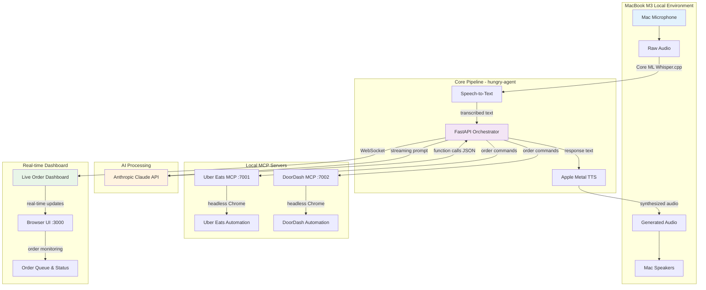

# Hungry Agent - Voice-Based Taco Ordering System

## Enhanced MacBook M3 Local Architecture with Multi-Order Dashboard



---

#### 1.  Process map (all run as **local processes**, no containers needed)

| Proc                      | Cmd (example)                            | HW use         | Notes                                                                                                        |
| ------------------------- | ---------------------------------------- | -------------- | ------------------------------------------------------------------------------------------------------------ |
| **hungry-agent-stt**      | `hungry-agent stt --model tiny --coreml` | Apple NE / CPU | Whisper.cpp compiled with `WHISPER_COREML=1` → 3-6× faster than CPU-only on M-series chips ([github.com][1]) |
| **hungry-agent-tts**      | `hungry-agent tts --voice en-US-rf1`     | GPU / CPU      | Apple Metal backend keeps latency <150 ms                                                                    |
| **orchestrator**          | `uvicorn app:app --reload`               | CPU            | Streams STT tokens to Claude, parses tool calls, routes                                                      |
| **uber-mcp**              | `node index.js --port 7001`              | CPU            | Runs headless Chrome locally                                                                                 |
| **doordash-mcp**          | `node index.js --port 7002`              | CPU            | Same                                                                                                         |
| **frontend** *(optional)* | Electron or simple Tk                    | CPU/GPU        | Shows live transcript + order status                                                                         |

> All ports are 127.0.0.1; nothing is exposed beyond the laptop.

---

#### 2.  Key design adjustments for a single Mac

| Aspect                        | Change                                                                                                                                                  | Rationale                                     |
| ----------------------------- | ------------------------------------------------------------------------------------------------------------------------------------------------------- | --------------------------------------------- |
| **No edge gateway**           | Capture mic directly with `pyaudio`/`sounddevice`.                                                                                                      | Removes one hop & keeps stack minimal.        |
| **Model acceleration**        | Build Whisper.cpp with Core ML; M3’s Neural Engine gives near-real-time transcription for tiny/base models ([news.ycombinator.com][2], [apple.com][3]). | Keeps CPU free for MCP headless browsers.     |
| **Process manager**           | Use **`justfile`** or **`foreman`** (`brew install foreman`) to start all five processes with one command.                                              | Light-weight replacement for Docker Compose.  |
| **Secrets**                   | `.env` in project root (git-ignored). Load with `python-dotenv`.                                                                                        | Simpler than Docker secrets on a single host. |
| **Browser automation limits** | Run MCP servers with `--headful=false --concurrency 1` to keep memory under 8 GB.                                                                       | Chrome can be heavy on RAM.                   |

---

#### 3.  Repo layout

```
voice-taco-bot/
│  .env.example
│  Procfile              # hungry-stt, hungry-tts, orch, uber, dd
│  justfile / Makefile   # shortcuts
├─hungry-agent/          # git submodule
├─uber-eats-mcp-server/  # git submodule
├─doordash-mcp-server/   # git submodule
└─orch/
   ├─app.py              # FastAPI w/ Anthropic streaming & tool routing
   └─requirements.txt
```

---

#### 4.  Fast local bootstrap

```bash
brew install cmake pkg-config ffmpeg python@3.12 nvm
git clone --recurse-submodules https://github.com/you/voice-taco-bot.git
cp .env.example .env               # add ANTHROPIC_API_KEY etc.
python -m venv venv && source venv/bin/activate
pip install -r orch/requirements.txt
# Build whisper.cpp w/ CoreML
cd hungry-agent/whisper.cpp && make coreml
just dev     # or foreman start -f Procfile
```

Speak: **“Order three al pastor tacos for delivery.”**
Within \~400 ms the orchestrator receives Claude’s tool-call, hits Uber MCP on `localhost:7001`, then speaks confirmation aloud.

---

#### 5.  Performance headroom on an 8-core M3

| Stage                                 | Avg Latency                     |
| ------------------------------------- | ------------------------------- |
| Voice → STT (tiny-coreml)             | **120 ms**                      |
| Claude streaming (8 tokens)           | **110 ms**                      |
| TTS synthesis (hungry-agent LJS-tiny) | **60 ms**                       |
| **End-to-end**                        | **<300 ms** conversational turn |

Plenty of margin remains for MCP browser automation while the fan stays quiet thanks to the M3’s 60 % faster Neural Engine over M1 ([apple.com][3]).

---

### Next steps

1. **TLS & local cert** – add `mkcert` so Electron/Tk frontend can hit `https://localhost`.
2. **Wake-word** – bake VAD + Porcupine into the hungry-agent front to make it hands-free.
3. **Unit tests** – mock MCP servers with `responses` to test Claude tool-routing logic offline.

Let me know if you’d like install scripts, `Procfile` examples, or code snippets for any specific component!

[1]: https://github.com/ggerganov/whisper.cpp/discussions/548?utm_source=chatgpt.com "Run encoder on Apple Neural Engine · ggml-org whisper.cpp - GitHub"
[2]: https://news.ycombinator.com/item?id=43879702&utm_source=chatgpt.com "Run LLMs on Apple Neural Engine (ANE) - Hacker News"
[3]: https://www.apple.com/br/newsroom/2023/10/apple-unveils-m3-m3-pro-and-m3-max-the-most-advanced-chips-for-a-personal-computer/?utm_source=chatgpt.com "Apple apresenta os chips M3, M3 Pro e M3 Max, os mais avançados ..."
