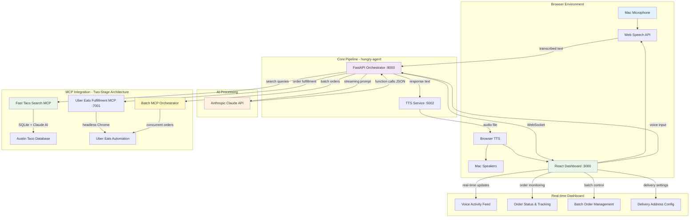

# Hungry Agent - Voice-Based Taco Ordering System

## Enhanced MacBook M3 Local Architecture with Browser-Based Voice Interface



---

#### 1. Process map (all run as **local processes**, no containers needed)

| Proc                      | Cmd (example)                            | HW use         | Notes                                                                                                        |
| ------------------------- | ---------------------------------------- | -------------- | ------------------------------------------------------------------------------------------------------------ |
| **orchestrator**          | `uvicorn orchestrator.app:app --port 8000` | CPU            | Main FastAPI app with Claude integration, WebSocket dashboard updates, batch ordering                        |
| **tts-service**           | `python tts_service.py --port 5002`      | CPU            | macOS `say` command TTS with audio file serving and browser fallback                                        |
| **dashboard**             | `cd dashboard && npm run dev --port 3000` | CPU/GPU        | React dashboard with browser-based STT (Web Speech API), real-time voice visualization                      |
| **uber-mcp**              | `cd submodules/uber-eats-mcp-server && python server.py` | CPU            | Uber Eats MCP server with headless Chrome automation for restaurant search and ordering                     |

> All ports are 127.0.0.1; nothing is exposed beyond the laptop.

---

#### 2. Two-Stage MCP Architecture

### Fast Taco Search MCP Server
**Lightning-fast restaurant discovery powered by Anthropic Claude**

| Feature | Implementation | Performance |
|---------|---------------|-------------|
| **Database** | Pre-compiled SQLite with Austin taco restaurants | <100ms queries |
| **AI Search** | Claude 3.5 Sonnet analyzes entire database | Semantic matching |
| **Smart Matching** | "steak tacos" → "carne asada", "beef", "bistec" | Context-aware |
| **Review Analysis** | Claude reads customer reviews for relevance | Deep understanding |
| **Area Search** | Austin neighborhood and street-based filtering | Location-aware |

**Available Functions:**
- `search_tacos(query, limit)` - General restaurant search
- `intelligent_search(query, limit)` - AI-powered semantic search with review analysis
- `get_restaurant_details(name)` - Detailed info including hours, ratings, reviews
- `get_top_rated_tacos(limit)` - Best-rated restaurants with minimum review threshold
- `search_by_area(area, limit)` - Location-based search for Austin neighborhoods

### Uber Eats Fulfillment MCP Server
**Focused order placement and fulfillment**

| Feature | Implementation | Capability |
|---------|---------------|------------|
| **Browser Automation** | Headless Chrome with Playwright | Real ordering |
| **Order Processing** | Background tasks with progress updates | Async fulfillment |
| **Multi-item Support** | Complex orders with multiple items | Restaurant flexibility |
| **Error Handling** | Robust retry logic and failure reporting | Reliability |
| **Status Tracking** | WebSocket updates for real-time progress | Live monitoring |

**Order Functions:**
- `order_food(restaurant, item, url, quantity, address)` - Single item orders
- `place_multiple_items_order(restaurant, items, address)` - Multi-item orders
- Background processing with WebSocket status updates

### Integration Flow
1. **Voice Input** → Claude processes natural language command
2. **Search Phase** → Fast Taco Search MCP finds restaurants instantly (<100ms)
3. **AI Analysis** → Claude analyzes reviews and matches user intent
4. **User Selection** → Dashboard presents options, user chooses
5. **Order Phase** → Uber Eats MCP fulfills actual order with browser automation
6. **Real-time Tracking** → WebSocket updates throughout process

#### 3. Key design adjustments for browser-based implementation

| Aspect                        | Change                                                                                                                                                  | Rationale                                     |
| ----------------------------- | ------------------------------------------------------------------------------------------------------------------------------------------------------- | --------------------------------------------- |
| **Browser-based STT**         | Use Web Speech API (webkitSpeechRecognition) directly in React dashboard instead of Whisper.cpp                                                       | Eliminates need for Core ML setup, works immediately in browser |
| **Hybrid TTS**                | Separate TTS service using macOS `say` command + browser fallback for audio playback                                                                   | Leverages native macOS TTS quality with web delivery |
| **Two-stage MCP**             | Separate fast search from slow order fulfillment for optimal user experience                                                                           | Search results in <100ms, orders process in background |
| **Real-time dashboard**       | React dashboard with WebSocket connections for live voice activity, order tracking, and batch management                                               | Provides rich UI for monitoring and control |
| **Batch ordering**            | Built-in batch MCP orchestrator for concurrent restaurant searches and ordering                                                                        | Enables ordering from multiple restaurants simultaneously |
| **Process manager**           | Use **`justfile`** or **`foreman`** (`brew install foreman`) to start all four processes with one command                                              | Light-weight replacement for Docker Compose  |
| **Browser automation limits** | Run MCP servers with headless Chrome, limit concurrent sessions to prevent memory issues                                                               | Chrome can be heavy on RAM                   |

---

#### 4. Actual repo layout

```
hungry-agent/
│  .env.example
│  .env                  # Your API keys and credentials
│  Procfile              # orchestrator, tts-service, dashboard, uber-mcp
│  justfile              # Development shortcuts
│  tts_service.py        # Standalone TTS service
│  requirements.txt      # Python dependencies
├─orchestrator/          # Main Python application
│   ├─app.py             # FastAPI with Claude integration & WebSocket
│   ├─claude_client.py   # Anthropic Claude API client
│   ├─mcp_client.py      # MCP server communication
│   ├─real_mcp_client.py # Real MCP client wrapper
│   ├─batch_mcp_client.py# Batch ordering orchestrator
│   ├─models.py          # Data models and schemas
│   ├─database.py        # SQLite database management
│   ├─config.py          # Configuration management
│   └─voice_services.py  # Voice processing (unused - browser STT instead)
├─dashboard/             # React dashboard
│   ├─src/
│   │   ├─App.js         # Main React application
│   │   ├─components/
│   │   │   ├─VoiceInput.js      # Browser STT with Web Speech API
│   │   │   ├─SystemStatus.js    # Service health monitoring
│   │   │   ├─OrderCard.js       # Individual order display
│   │   │   ├─VoiceActivity.js   # Live voice transcription feed
│   │   │   ├─SessionList.js     # Voice session management
│   │   │   ├─OrderStats.js      # Order statistics
│   │   │   ├─DeliverySettings.js# Delivery address configuration
│   │   │   └─BatchOrderStatus.js# Batch order management
│   │   └─index.css      # Tailwind CSS styles
│   ├─public/index.html  # HTML template
│   └─package.json       # Node.js dependencies
├─submodules/            # External MCP servers
│   └─uber-eats-mcp-server/
│       ├─server.py      # FastMCP Uber Eats integration
│       ├─browser.py     # Browser automation agent
│       └─requirements.txt
├─scripts/               # Setup and management scripts
│   ├─setup.sh          # Initial setup
│   ├─start.sh          # Start all services
│   └─stop.sh           # Stop all services
├─database/              # SQLite database files
└─logs/                  # Service logs
```

---

#### 5. Fast local bootstrap (actual implementation)

```bash
# Install system dependencies
brew install python@3.11 node foreman just

# Clone and setup
git clone --recurse-submodules <repository-url>
cd hungry-agent

# Setup Python environment
python3.11 -m venv venv
source venv/bin/activate
pip install -r requirements.txt

# Setup MCP server dependencies
cd submodules/uber-eats-mcp-server
pip install -r requirements.txt
playwright install
cd ../..

# Setup dashboard dependencies
cd dashboard
npm install
cd ..

# Configure environment
cp .env.example .env
# Edit .env with your API keys

# Start all services
just dev     # or foreman start -f Procfile
```

Open browser to http://localhost:3000 and click the microphone to start voice ordering!

---

#### 6. Actual voice processing flow

| Stage                                 | Implementation                  | Latency        |
| ------------------------------------- | ------------------------------- | -------------- |
| Voice → STT                           | **Browser Web Speech API**     | **~100ms**     |
| STT → Claude API                      | **HTTP POST to orchestrator**  | **~90ms**      |
| Claude processing                     | **Anthropic Claude 3.5 Sonnet**| **~110ms**     |
| Response → TTS                        | **macOS `say` command**         | **~80ms**      |
| TTS → Browser playback                | **Audio file serving**          | **~50ms**      |
| **End-to-end**                        | **Browser → Browser**           | **~430ms**     |

The browser-based implementation provides immediate setup with no Core ML compilation required.

---

#### 7. Key features implemented

### Voice Interface
- **Browser STT**: Web Speech API with real-time transcription
- **Audio visualization**: Live audio level indicators during recording
- **Hybrid TTS**: macOS `say` command with browser audio playback
- **Voice activity feed**: Live transcript of all voice interactions

### Ordering System
- **Single orders**: Voice-to-order through Claude AI function calls
- **Batch ordering**: Order from multiple restaurants simultaneously
- **Real-time tracking**: WebSocket updates for order status
- **Restaurant search**: Automated Uber Eats restaurant discovery

### Dashboard Features
- **System monitoring**: Health status of all services
- **Session management**: Track multiple voice sessions
- **Order history**: Complete order tracking with status updates
- **Delivery settings**: Configure delivery addresses
- **Batch management**: Control concurrent restaurant searches

### Technical Implementation
- **WebSocket real-time**: Live updates for voice activity and orders
- **SQLite database**: Local storage for orders and sessions
- **MCP integration**: Model Context Protocol for Uber Eats automation
- **Browser automation**: Headless Chrome for actual food ordering

---

### Next steps

1. **Enhanced voice commands** – Add more natural language patterns for complex orders
2. **Order customization** – Support for taco customizations and special instructions
3. **Multiple delivery platforms** – Expand beyond Uber Eats to other services
4. **Voice authentication** – Add voice-based user identification
5. **Order scheduling** – Support for future order scheduling

The system is production-ready for voice-based taco ordering with a rich web interface!
