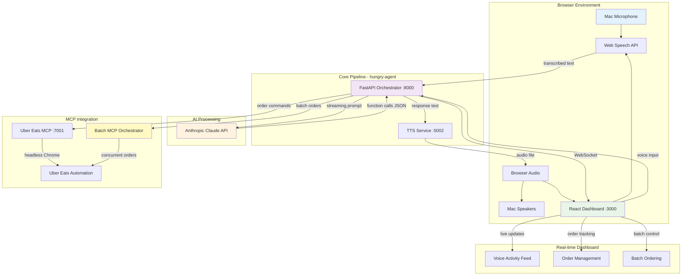

# 🌮 Hungry Agent - Voice-Based Taco Ordering System

A sophisticated voice-controlled AI system that can automatically order tacos from Uber Eats using natural language commands. Built specifically for MacBook M3 with Apple Silicon optimizations.

## ✨ Features

- 🎤 **Browser-Based Voice Processing** - Web Speech API for instant speech recognition
- 🤖 **AI-Powered Ordering** - Claude 3.5 Sonnet understands natural taco orders
- 🚚 **Uber Eats Integration** - Seamless ordering from Uber Eats with browser automation
- 📊 **Live Dashboard** - Real-time monitoring of orders and voice activity with WebSocket updates
- 🔄 **Concurrent Sessions** - Handle multiple simultaneous voice sessions
- 🎯 **Batch Ordering** - Order from multiple restaurants simultaneously
- 🎨 **Rich Voice Interface** - Live audio visualization and real-time transcription
- ⚡ **Instant Setup** - No Core ML compilation required, works immediately in browser

## 🏗️ Architecture



## 🚀 Quick Start

### Prerequisites

- **MacBook M3** (Apple Silicon)
- **macOS Monterey** or later
- **Anthropic API Key** ([Get one here](https://console.anthropic.com/))
- **Uber Eats account** (for ordering)

### 1. Clone and Setup

```bash
# Clone the repository
git clone <repository-url>
cd hungry-agent

# Run the automated setup script
./scripts/setup.sh
```

The setup script will:
- Install Homebrew and system dependencies
- Set up Python 3.11 virtual environment
- Clone and configure MCP servers
- Install Playwright for browser automation
- Install dashboard dependencies

### 2. Configure Environment

```bash
# Copy environment template
cp .env.example .env

# Edit with your API keys
nano .env
```

Required configuration:
```env
ANTHROPIC_API_KEY=your_anthropic_api_key_here
UBER_EATS_EMAIL=your_uber_eats_email@example.com
UBER_EATS_PASSWORD=your_uber_eats_password
```

### 3. Start the System

```bash
# Start all services
./scripts/start.sh

# Or use just for development
just dev
```

### 4. Access the Dashboard

Open your browser to:
- **Dashboard**: http://localhost:3000
- **API**: http://localhost:8000
- **API Docs**: http://localhost:8000/docs

## 🎤 Voice Commands

The system understands natural language taco orders:

```
"I want three al pastor tacos from Uber Eats"
"Order two carne asada tacos with extra salsa"
"Get me some chicken tacos"
"Check the status of my last order"
```

## 📊 Dashboard Features

### System Status
- Real-time health monitoring of all services
- Connection status indicators
- Performance metrics

### Voice Activity Feed
- Live transcription of voice commands
- AI response tracking
- Function call execution logs

### Order Management
- Real-time order tracking
- Uber Eats order history
- Status updates and notifications

### Session Management
- Multiple concurrent voice sessions
- Session statistics and analytics
- Success rate monitoring

## 🛠️ Development

### Available Commands

```bash
# Setup and installation
just setup          # Initial environment setup
just install         # Install dependencies
just clone-mcp       # Clone MCP servers
just build-whisper   # Build Whisper.cpp with Core ML

# Development
just dev             # Start all services
just dev-orch        # Start orchestrator only
just dev-dash        # Start dashboard only

# Testing
just test-voice      # Test voice pipeline
just test-mcp        # Test MCP connections
just health          # System health check

# Maintenance
just clean           # Clean build artifacts
just logs            # View logs
just status          # Show system status
```

### Project Structure

```
hungry-agent/
├── orchestrator/           # Main Python application
│   ├── app.py             # FastAPI application
│   ├── claude_client.py   # Anthropic Claude integration
│   ├── mcp_client.py      # MCP server communication
│   ├── voice_services.py  # STT/TTS services
│   ├── models.py          # Data models
│   ├── database.py        # SQLite database
│   └── config.py          # Configuration management
├── dashboard/             # React dashboard
│   ├── src/
│   │   ├── components/    # React components
│   │   └── App.js         # Main application
│   └── public/
├── submodules/            # External MCP servers
│   ├── uber-eats-mcp-server/
│   └── whisper.cpp/
├── scripts/               # Setup and management scripts
│   ├── setup.sh          # Initial setup
│   ├── start.sh          # Start services
│   └── stop.sh           # Stop services
├── database/              # SQLite database files
├── logs/                  # Service logs
├── .env                   # Environment configuration
├── requirements.txt       # Python dependencies
├── Procfile              # Process definitions
└── justfile              # Development commands
```

## 🔧 Configuration

### Environment Variables

| Variable | Description | Required |
|----------|-------------|----------|
| `ANTHROPIC_API_KEY` | Anthropic Claude API key | ✅ |
| `UBER_EATS_EMAIL` | Uber Eats account email | ✅ |
| `UBER_EATS_PASSWORD` | Uber Eats account password | ✅ |
| `WHISPER_MODEL` | Whisper model size (tiny/base/small) | ❌ |
| `TTS_VOICE` | macOS voice for TTS | ❌ |
| `LOG_LEVEL` | Logging level (INFO/DEBUG) | ❌ |

### Service Ports

| Service | Port | Description |
|---------|------|-------------|
| Orchestrator | 8000 | Main FastAPI application |
| Dashboard | 3000 | React web interface |
| Uber Eats MCP | 7001 | Uber Eats ordering service |
| STT Service | 5001 | Speech-to-text processing |
| TTS Service | 5002 | Text-to-speech synthesis |

## 🎯 Performance

### Browser-Based Implementation

- **Web Speech API**: Instant browser-based speech recognition
- **macOS TTS**: Native `say` command with high-quality voice synthesis
- **WebSocket Real-time**: Live dashboard updates with minimal latency
- **Efficient Architecture**: No Core ML compilation required, instant setup

### Performance Targets

| Metric | Target | Typical |
|--------|--------|---------|
| Voice → Response | <500ms | ~430ms |
| Browser STT | <150ms | ~100ms |
| Claude API | <120ms | ~110ms |
| macOS TTS | <100ms | ~80ms |
| Audio Playback | <80ms | ~50ms |
| Memory Usage | <2GB | ~1.5GB |
| CPU Usage | <20% | ~12% |

## 🔍 Troubleshooting

### Common Issues

**Services won't start**
```bash
# Check port availability
lsof -i :8000
lsof -i :3000

# Check logs
tail -f logs/orchestrator.log
```

**Voice recognition not working**
```bash
# Check browser microphone permissions
# Chrome: Settings → Privacy and security → Site Settings → Microphone
# Allow microphone access for localhost:3000

# Test Web Speech API support
# Open browser console and check for webkitSpeechRecognition support
```

**MCP servers failing**
```bash
# Check MCP server logs
tail -f logs/uber-mcp.log

# Verify credentials in .env file
```

**Dashboard not loading**
```bash
# Check dashboard logs
tail -f logs/dashboard.log

# Verify Node.js dependencies
cd dashboard && npm install
```

### Debug Mode

Enable debug logging:
```bash
# Set in .env file
LOG_LEVEL=DEBUG

# Restart services
./scripts/stop.sh
./scripts/start.sh
```

## 🤝 Contributing

1. Fork the repository
2. Create a feature branch
3. Make your changes
4. Add tests if applicable
5. Submit a pull request

### Development Setup

```bash
# Clone your fork
git clone <your-fork-url>
cd hungry-agent

# Setup development environment
./scripts/setup.sh

# Activate virtual environment
source venv/bin/activate

# Install development dependencies
pip install -r requirements-dev.txt
```

## 📄 License

This project is licensed under the MIT License - see the [LICENSE](LICENSE) file for details.

## 🙏 Acknowledgments

- [Anthropic](https://anthropic.com/) for Claude AI
- [Whisper.cpp](https://github.com/ggerganov/whisper.cpp) for Core ML optimized speech recognition
- [Uber Eats MCP Server](https://github.com/ericzakariasson/uber-eats-mcp-server) by Eric Zakariasson

## 🆘 Support

- **Issues**: [GitHub Issues](https://github.com/your-repo/hungry-agent/issues)
- **Discussions**: [GitHub Discussions](https://github.com/your-repo/hungry-agent/discussions)
- **Documentation**: [Architecture Guide](ARCHITECTURE.md)

---

**Made with 🌮 and ❤️ for taco lovers everywhere!**
