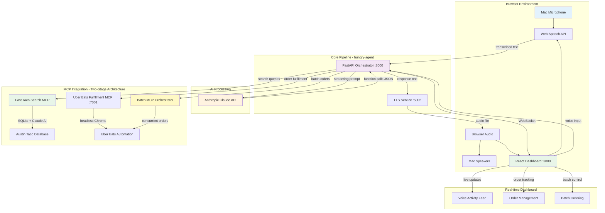

# 🌮 Hungry Agent - Voice-Based Taco Ordering System

A sophisticated voice-controlled AI system that can automatically order tacos from Uber Eats using natural language commands. Built specifically for MacBook M3 with Apple Silicon optimizations.

## ✨ Features

- 🎤 **Browser-Based Voice Processing** - Web Speech API for instant speech recognition
- 🤖 **AI-Powered Ordering** - Claude 3.5 Sonnet understands natural taco orders
- 🔍 **Lightning-Fast Taco Search** - Anthropic-powered semantic search through Austin taco database
- 🚚 **Uber Eats Integration** - Seamless ordering from Uber Eats with browser automation
- 📊 **Live Dashboard** - Real-time monitoring of orders and voice activity with WebSocket updates
- 🔄 **Concurrent Sessions** - Handle multiple simultaneous voice sessions
- 🎯 **Batch Ordering** - Order from multiple restaurants simultaneously
- 🎨 **Rich Voice Interface** - Live audio visualization and real-time transcription
- ⚡ **Instant Setup** - No Core ML compilation required, works immediately in browser
- 🧠 **Intelligent Restaurant Discovery** - Claude analyzes reviews and menus for perfect matches

## 🏗️ Architecture



## 🚀 Quick Start

### Prerequisites

- **MacBook M3** (Apple Silicon)
- **macOS Monterey** or later
- **Anthropic API Key** ([Get one here](https://console.anthropic.com/))
- **Uber Eats account** (for ordering)

### 1. Clone and Setup

```bash
# Clone the repository
git clone <repository-url>
cd hungry-agent

# Run the automated setup script
./scripts/setup.sh
```

The setup script will:
- Install Homebrew and system dependencies
- Set up Python 3.11 virtual environment
- Clone and configure MCP servers
- Install Playwright for browser automation
- Install dashboard dependencies

### 2. Configure Environment

```bash
# Copy environment template
cp .env.example .env

# Edit with your API keys
nano .env
```

Required configuration:
```env
ANTHROPIC_API_KEY=your_anthropic_api_key_here
UBER_EATS_EMAIL=your_uber_eats_email@example.com
UBER_EATS_PASSWORD=your_uber_eats_password
```

### 3. Start the System

```bash
# Start all services
./scripts/start.sh

# Or use just for development
just dev
```

### 4. Access the Dashboard

Open your browser to:
- **Dashboard**: http://localhost:3000
- **API**: http://localhost:8000
- **API Docs**: http://localhost:8000/docs

## 🔧 MCP Architecture - Two-Stage System

### Fast Taco Search MCP Server
**Lightning-fast restaurant discovery powered by Anthropic Claude**

- **SQLite Database**: Pre-compiled Austin taco restaurant data with reviews and ratings
- **Semantic Search**: Claude analyzes entire database for intelligent matching
- **Sub-second Response**: Database queries return results in <100ms
- **Smart Matching**: "steak tacos" matches "carne asada", "beef", "bistec" automatically
- **Review Analysis**: Claude reads customer reviews to find perfect matches

**Available Search Functions:**
- `search_tacos()` - General taco restaurant search
- `intelligent_search()` - AI-powered semantic search with review analysis
- `get_restaurant_details()` - Detailed info including hours, ratings, reviews
- `get_top_rated_tacos()` - Best-rated restaurants with minimum review threshold
- `search_by_area()` - Location-based search for Austin neighborhoods

### Uber Eats Fulfillment MCP Server
**Focused order placement and fulfillment**

- **Browser Automation**: Headless Chrome with Playwright for real ordering
- **Order Fulfillment**: Takes restaurant + item details from search results
- **Multi-item Orders**: Place complex orders with multiple items
- **Real-time Status**: Background processing with progress updates
- **Error Handling**: Robust retry logic and failure reporting

**Order Functions:**
- `order_food()` - Place single item orders with direct URLs
- `place_multiple_items_order()` - Order multiple items from same restaurant
- Background processing with WebSocket status updates

### Integration Flow
1. **Voice Input** → Claude processes natural language
2. **Search Phase** → Fast Taco Search MCP finds restaurants instantly
3. **Selection** → User chooses from search results
4. **Order Phase** → Uber Eats MCP fulfills the actual order
5. **Tracking** → Real-time updates via WebSocket

## 🎤 Voice Commands

The system understands natural language taco orders:

```
"I want three al pastor tacos from Uber Eats"
"Order two carne asada tacos with extra salsa"
"Get me some chicken tacos"
"Find the best steak tacos in downtown Austin"
"Search for spicy beef tacos with good reviews"
"Check the status of my last order"
```

## 📊 Dashboard Features

### System Status
- Real-time health monitoring of all services
- Connection status indicators
- Performance metrics

### Voice Activity Feed
- Live transcription of voice commands
- AI response tracking
- Function call execution logs

### Order Management
- Real-time order tracking
- Uber Eats order history
- Status updates and notifications

### Session Management
- Multiple concurrent voice sessions
- Session statistics and analytics
- Success rate monitoring

## 🛠️ Development

### Available Commands

```bash
# Setup and installation
just setup          # Initial environment setup
just install         # Install dependencies
just clone-mcp       # Clone MCP servers
just build-whisper   # Build Whisper.cpp with Core ML

# Development
just dev             # Start all services
just dev-orch        # Start orchestrator only
just dev-dash        # Start dashboard only

# Testing
just test-voice      # Test voice pipeline
just test-mcp        # Test MCP connections
just health          # System health check

# Maintenance
just clean           # Clean build artifacts
just logs            # View logs
just status          # Show system status
```

### Project Structure

```
hungry-agent/
├── orchestrator/           # Main Python application
│   ├── app.py             # FastAPI application
│   ├── claude_client.py   # Anthropic Claude integration
│   ├── mcp_client.py      # MCP server communication
│   ├── voice_services.py  # STT/TTS services
│   ├── models.py          # Data models
│   ├── database.py        # SQLite database
│   └── config.py          # Configuration management
├── dashboard/             # React dashboard
│   ├── src/
│   │   ├── components/    # React components
│   │   └── App.js         # Main application
│   └── public/
├── submodules/            # External MCP servers
│   ├── uber-eats-mcp-server/
│   └── whisper.cpp/
├── scripts/               # Setup and management scripts
│   ├── setup.sh          # Initial setup
│   ├── start.sh          # Start services
│   └── stop.sh           # Stop services
├── database/              # SQLite database files
├── logs/                  # Service logs
├── .env                   # Environment configuration
├── requirements.txt       # Python dependencies
├── Procfile              # Process definitions
└── justfile              # Development commands
```

## 🔧 Configuration

### Environment Variables

| Variable | Description | Required |
|----------|-------------|----------|
| `ANTHROPIC_API_KEY` | Anthropic Claude API key | ✅ |
| `UBER_EATS_EMAIL` | Uber Eats account email | ✅ |
| `UBER_EATS_PASSWORD` | Uber Eats account password | ✅ |
| `WHISPER_MODEL` | Whisper model size (tiny/base/small) | ❌ |
| `TTS_VOICE` | macOS voice for TTS | ❌ |
| `LOG_LEVEL` | Logging level (INFO/DEBUG) | ❌ |

### Service Ports

| Service | Port | Description |
|---------|------|-------------|
| Orchestrator | 8000 | Main FastAPI application |
| Dashboard | 3000 | React web interface |
| Uber Eats MCP | 7001 | Uber Eats ordering service |
| STT Service | 5001 | Speech-to-text processing |
| TTS Service | 5002 | Text-to-speech synthesis |

## 🔍 Troubleshooting

### Common Issues

**Services won't start**
```bash
# Check port availability
lsof -i :8000
lsof -i :3000

# Check logs
tail -f logs/orchestrator.log
```

**Voice recognition not working**
```bash
# Check browser microphone permissions
# Chrome: Settings → Privacy and security → Site Settings → Microphone
# Allow microphone access for localhost:3000

# Test Web Speech API support
# Open browser console and check for webkitSpeechRecognition support
```

**MCP servers failing**
```bash
# Check MCP server logs
tail -f logs/uber-mcp.log

# Verify credentials in .env file
```

**Dashboard not loading**
```bash
# Check dashboard logs
tail -f logs/dashboard.log

# Verify Node.js dependencies
cd dashboard && npm install
```

### Debug Mode

Enable debug logging:
```bash
# Set in .env file
LOG_LEVEL=DEBUG

# Restart services
./scripts/stop.sh
./scripts/start.sh
```

## 🤝 Contributing

1. Fork the repository
2. Create a feature branch
3. Make your changes
4. Add tests if applicable
5. Submit a pull request

### Development Setup

```bash
# Clone your fork
git clone <your-fork-url>
cd hungry-agent

# Setup development environment
./scripts/setup.sh

# Activate virtual environment
source venv/bin/activate

# Install development dependencies
pip install -r requirements-dev.txt
```

## 📄 License

This project is licensed under the MIT License - see the [LICENSE](LICENSE) file for details.

## 🙏 Acknowledgments

- [Anthropic](https://anthropic.com/) for Claude AI
- [Whisper.cpp](https://github.com/ggerganov/whisper.cpp) for Core ML optimized speech recognition
- [Uber Eats MCP Server](https://github.com/ericzakariasson/uber-eats-mcp-server) by Eric Zakariasson

## 🆘 Support

- **Issues**: [GitHub Issues](https://github.com/your-repo/hungry-agent/issues)
- **Discussions**: [GitHub Discussions](https://github.com/your-repo/hungry-agent/discussions)
- **Documentation**: [Architecture Guide](ARCHITECTURE.md)

---

**Made with 🌮 and ❤️ for taco lovers everywhere!**
